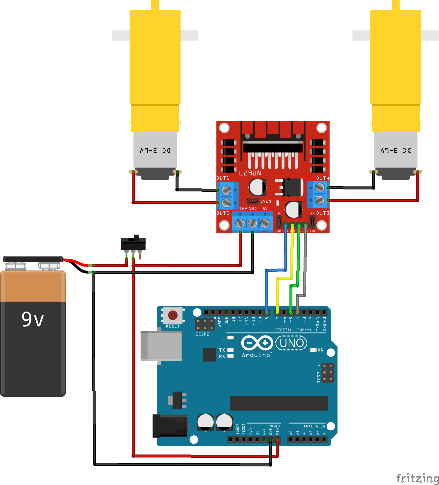

# ArduinoCar
<div style="display: inline_block">
  
</div>

Uma série de projetos a serem utilizados nos cursos de tecnologia e robótica do SESI Maker - Joaçaba.
Este repositório inclui desde a montagem do chassis 2WD até um conjunto de códigos a serem utilizados pelos alunos.
Conceitos como fontes de energia alternativa, funcionamento de motores elétricos, carros elétricos e o futuro da mobilidade podem ser exploradas nas aulas.

## Montagem chassis 2WD
A baixo é apresentado um vídeo para auxiliar os alunos na montagem do chassis 2WD.
[](https://www.youtube.com/watch?v=o29VYftnl4Y)
Para uso com shields de motores recomento a troca do conjunto de 4 pilhas por um conector de baterias 9V.

## Uso
Abaixo uma lista de montagem elétrica de cada projeto e o funcionamento dos códigos para implementação.

### carBase
Um projeto simples de acionamento de motores para locomover o chassis. Utiliza um módulo [L298N](http://www.handsontec.com/dataspecs/L298N%20Motor%20Driver.pdf) que possui duas pontes H para acionamento dos motores. A montagem elétrica pode ser vista abaixo:



O código já possui implementação das funções do carro andar para frente, parar, virar para a esquerda, virar para a direita e andar para trás que devem ser utilizadas dentro do método ```percuros()``` sempre acompanhada de uma função ```delay()``` que representa o tempo que o protótipo irá executar aquela função. Ao fim da execução do percurso o protótipo ficará parado.
Abaixo é apresentado um exemplo do método percuros.

``` C++
void percurso(){
  //Codifique aqui o seu percurso
  paraFrente();
  delay(2000);
  paraEsquerda();
  delay(500);
  paraFrente();
  delay(2000);
  paraDireita();
  delay(500);
  paraFrente();
  delay(2000);
}
```

#### Links Relacionados
- [Guia definitivo do L298N](https://blog.eletrogate.com/guia-definitivo-de-uso-da-ponte-h-l298n/)