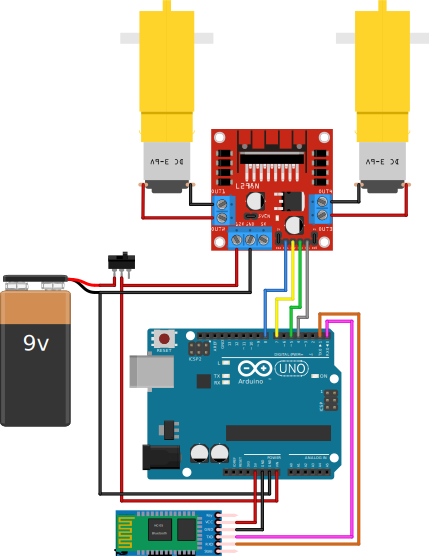

# ArduinoCar
<div style="display: inline_block">
  
</div>

Uma série de projetos a serem utilizados nos cursos de tecnologia e robótica do SESI Maker - Joaçaba.
Este repositório inclui desde a montagem do chassis 2WD até um conjunto de códigos a serem utilizados pelos alunos.
Conceitos como fontes de energia alternativa, funcionamento de motores elétricos, carros elétricos e o futuro da mobilidade podem ser exploradas nas aulas.

## Montagem chassis 2WD
A baixo é apresentado um vídeo para auxiliar os alunos na montagem do chassis 2WD.
[](https://www.youtube.com/watch?v=o29VYftnl4Y)
Para uso com shields de motores recomento a troca do conjunto de 4 pilhas por um conector de baterias 9V.

## Uso
Abaixo uma lista de montagem elétrica de cada projeto e o funcionamento dos códigos para implementação.

### carBase <a id="carBase" />
Um projeto simples de acionamento de motores para locomover o chassis. Utiliza um módulo [L298N](http://www.handsontec.com/dataspecs/L298N%20Motor%20Driver.pdf) que possui duas pontes H para acionamento dos motores. A montagem elétrica pode ser vista abaixo:


O código já possui implementação das funções do carro andar para frente, parar, virar para a esquerda, virar para a direita e andar para trás que devem ser utilizadas dentro do método ```percurso()``` sempre acompanhada de uma função ```delay()``` que representa o tempo que o protótipo irá executar aquela função. Ao fim da execução do percurso o protótipo ficará parado.
Abaixo é apresentado um exemplo do método percurso.

``` C++
void percurso(){
  //Codifique aqui o seu percurso
  paraFrente();
  delay(2000);
  paraEsquerda();
  delay(500);
  paraFrente();
  delay(2000);
  paraDireita();
  delay(500);
  paraFrente();
  delay(2000);
}
```

### carBaseIntDelay <a id="carBaseIntDelay" />
Este projeto possui a mesma montagem elétrica que o [carBase](#carBase) no entanto, neste projeto a função ```delay()``` é levada para dentro das funções de movimentação do protótipo. Este recurso deixa o código mais enxuto e fácil de entender.
Abaixo é apresentado o código do mesmo movimento que o carBase faz porêm com esta nova implementação.

``` C++
void percurso(){
  //Codifique aqui o seu percurso
  paraFrente(2000);
  paraEsquerda(500);
  paraFrente(2000);
  paraDireita(500);
  paraFrente(2000);
}
```

### carSmoothCurve <a id="carSmoothCurve" />

Neste projeto é possível fazer curvas suaves. A montagem sofre algumas alterações comparadas com as anteriores.


Para essa montagem os jumpers ```en1``` e ```en2``` devem ser reomovidos.

Chamando a função ```acionaMotores(m1, m2, miliSegundos)``` é possível acionar os dois motores ao mesmo tempo e dar uma porcentagem de potência para cada motor onde:
- ```m1``` representa a potência de aciomamento do primeiro motor. Pode variar de -100 a 100 onde -100 é potência total para trás e 100 potência total para frente;
- ```m2``` representa a potência de aciomamento do segundo motor. Pode variar de -100 a 100 onde -100 é potência total para trás e 100 potência total para frente;
- ```miliSegundos``` recebe o tempo que aquela função será executada em milisegundos.

Desta forma se chamarmos a função ```acionaMotores(100, 50, 500)``` o motor 1 será acionado com toda potência para frente e o motor 2 com apenas 50% da potência. Isto fará com que o protótipo faça uma curva suave e não rotacione o próprio eixo como nos exemplos [carBase](#carBase) e [carBaseIntDelay](#carBaseIntDelay).
Um exemplo de uso da função percurso pode ser visto a seguir.

``` C++
void percurso(){
  //Codifique aqui o seu percurso
  acionaMotores(100, 100, 2000);
  acionaMotores(100, 50, 500);
  acionaMotores(100, 100, 2000);
  acionaMotores(-50, -100, 500);
  acionaMotores(100, 100, 2000);
}
```

### carBluetooth <a id="carBluetooth" />

Neste projeto um módulo [HC-05](https://components101.com/sites/default/files/component_datasheet/HC-05%20Datasheet.pdf) é acoplado ao protótipo para poder controlar o veículo pelo celular. A montagem pode ser vista na figura a seguir.



O projeto foi testado com o app [Bluetooth RC Car](https://play.google.com/store/apps/details?id=braulio.calle.bluetoothRCcontroller) desenvolvido para android.
Para funcionamento é necessário prévia comunicação do módulo com o celular.

#### Links Relacionados
- [Guia definitivo do L298N](https://blog.eletrogate.com/guia-definitivo-de-uso-da-ponte-h-l298n/)